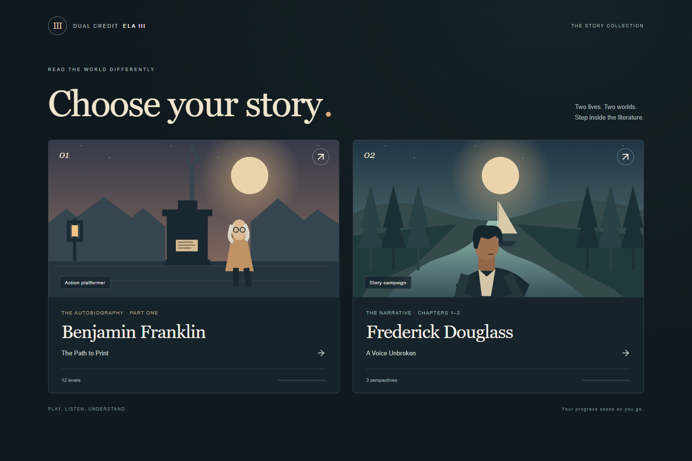
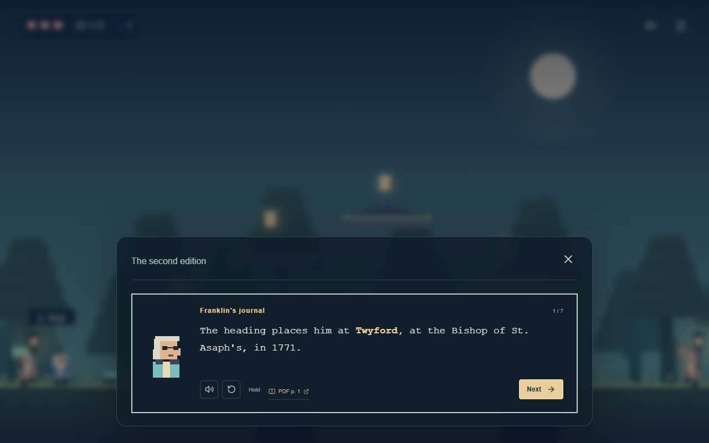

# Dual Credit ELA III

A browser game collection for Dual Credit English Language Arts III. The launch screen lets you choose a work; each campaign has its own progress and learning tools.

**[Play the collection](https://caleb-guyer.github.io/dual-credit-ela-iii/)**

| Work               | Campaign                                                                        | Scope                                                                              |
| ------------------ | ------------------------------------------------------------------------------- | ---------------------------------------------------------------------------------- |
| Benjamin Franklin  | [The Path to Print](https://caleb-guyer.github.io/dual-credit-ela-iii/#home)    | The supplied Part One PDF; 12 combat levels and optional detailed study            |
| Frederick Douglass | [A Voice Unbroken](https://caleb-guyer.github.io/dual-credit-ela-iii/#douglass) | Chapters I–III of the 1845 _Narrative_; three mission genres and a final challenge |



The existing repository name and Pages address are retained so previously shared links continue to work. `#home` opens Franklin directly; the root address and `#course` open the collection.

## Douglass: A Voice Unbroken

An atmospheric story campaign in three perspectives:

1. **A name of my own** — moonlit platforming, double jumps, dashes, and four remembered moments about identity, family separation, and the first encounter with slavery’s violence.
2. **What the songs carry** — a steerable river run with currents, rocks, bonus rings, braking, and a rechargeable surge. Testimony connects plantation wealth, deprivation, the Great House Farm, and the meaning of the songs.
3. **The price of truth** — a first-person raycast estate with a held lantern, cover, moving symbolic veils, an objective compass, and a small map. Inspect the garden, stables, roadside encounter, and surveillance behind enforced silence.

The campaign has **12 story moments**, short animated dialogue, browser narration with replay, original instrumental music that lowers under speech, checkpoints, mission scores, replay, a discovered-story archive, relaxed challenge, and reduced motion. Falls or lost focus return the player to a checkpoint. The final light leads to a **20-question multiple-choice challenge** selected from **36 questions**, balanced across all three chapters. Results include percentage, grade, topic strengths, every missed answer with an explanation and source, and a retry-missed round. Keys 1–4 answer questions without a confidence step.

### Douglass controls

| Mission                    | Keyboard                                                   | Phone/tablet                                         |
| -------------------------- | ---------------------------------------------------------- | ---------------------------------------------------- |
| Moonlit platformer         | A/D move, Space double jump, Shift dash                    | Move, dash, jump buttons                             |
| River navigation           | A/D steer, Shift surge, Space slow                         | Steering, surge, slow buttons                        |
| First-person investigation | WASD move, arrows or drag to look, E inspect, Shift sprint | Direction/turn buttons, drag to look, inspect button |
| Dialogue                   | Reveal/Next, Enter, replay and voice buttons               | The same on-screen controls                          |
| Pause                      | Escape or pause icon                                       | Pause icon                                           |

### Douglass source and adaptation

The primary text is Frederick Douglass’s _Narrative of the Life of Frederick Douglass, an American Slave_ (1845), **Chapters I, II, and III**, from the [Project Gutenberg transcript](https://www.gutenberg.org/files/23/23-h/23-h.htm#link2HCH0001). No Douglass class excerpt was supplied. All three chapters were read before the script and questions were authored. Their complete public-domain text is bundled in `src/douglass/source.json`, so the in-game evidence viewer works without another network request.

Each dialogue line and question has chapter/paragraph references such as `2.11`. The paragraph numbers identify the bundled transcript, not an edition’s printed page numbers. [The source outline](docs/douglass-source-outline.md) records coverage and adaptation decisions. The game distinguishes paraphrase from the brief exact reported exchange in Chapter III, preserves uncertainty about Douglass’s father, and treats the roadside story as a reported account.

Movement challenges, veils, lantern objectives, river navigation, estate geometry, and mission scores are fictional devices. The game does not claim that Douglass made an escape, piloted the Sally Lloyd, or fought a battle in these chapters. Historical violence is recounted through the narrator’s words, without a playable reenactment of abuse. The instrumental music is original, not a reproduction of the historical songs.

## Franklin: The Path to Print

### Part One — The Apprentice

Play as Franklin in a **2D platform adventure**: leap across rooftops, fight ink creatures and defeat each level’s guardian with a new weapon. Twelve chapter worlds turn the supplied Part One excerpt into a playable journey, with original music and study tools available from the menu.


### What is inside

- **12 combat platforming levels**, each with a different weapon: bow, axe, rapier, boomerang, hammer, spear, throwing daggers, crossbow, wind fan, glaive, scatter blaster and comet staff.
- Charging skitters, ranged sentries, flyers and a guardian. Enemies telegraph attacks; weapons have distinct ranges, timing, projectiles, piercing, return hits or area effects. Defeating an encounter opens its barrier.
- Double jumps, air dash, bounce pads, moving platforms, safe checkpoints and optional upper routes. A few health pickups and one temporary power boost reward exploration. There are **no book pickups**.
- **One NPC per level**, with just two short spoken lines explaining the main idea. No quiz interrupts combat or blocks the exit; clear the guardian to advance.
- Original procedural music with chapter variations, weapon and impact sounds, rising combat-combo tones and a saved mute switch. Music lowers automatically during speech.
- **Spoken character conversations** with original animated pixel portraits, letter-by-letter text, moving key words, short lines, replay, skip and Auto/Hold controls. The single guide gives the level’s main idea; the separate quiz, answer explanations and flashcards also have narration.
- A compact health/weapon HUD, keyboard and touch controls, saved chapter progress, combat scores, clear ranks, combos and personal best times for runs started from the beginning. Study tools stay in the menu.
- **272 multiple-choice questions**: specific factual prompts, chronology and relationships. Choose an answer with one click or keys 1–4; it scores immediately, without a confidence rating. Distractors reuse real details from the source bank.
- An optional detailed Story section with **12 chronological chapters, 60 scenes**, and recall trials. Detailed study stays available through the menu.
- **252 source-linked memory cards**, 66 character profiles and an interactive relationship web, a 60-item timeline, and a schematic location map.
- Historical decisions with a separate personal-choice mode; the source’s outcomes stay fixed. Dialogue reconstruction is explicitly labeled paraphrase.
- Quiz: Easy, Normal, Hard, Nightmare, 10/20/40-question rounds and Everything. A separate balanced **20-question Final Exam** spans all 12 chapters and mixes factual detail, relationships, books, places, ideas and chronology, all presented as multiple choice.
- Franklin’s Trouble List, weighted review, due dates, mastery, XP, levels, streaks, combos and eight achievements.
- Flashcards and character, chronology, people, place, publication/book, virtue/idea and obscure-detail drills.
- Browser saves, save export/import, confirmed reset, optional music and speech, reduced motion, large text, keyboard answer controls and mobile navigation.
- Full source PDF and all 27 readable scan images available inside the game. No external fonts, images, accounts or backend. Music is synthesized locally; narration uses the browser’s speech engine.

### Franklin controls

| Action                  | Keyboard              |
| ----------------------- | --------------------- |
| Move                    | A / D or Left / Right |
| Jump / double jump      | Space, W or Up        |
| Dash                    | Shift or X            |
| Attack (hold to repeat) | J, K, F or left click |
| Talk / enter print shop | E or Enter            |
| Pause                   | Escape                |
| Answer a question       | 1 / 2 / 3 / 4         |

Phones and tablets show movement, attack, dash and jump buttons. Hold attack to keep firing or swinging. Ranged weapons assist aim toward nearby enemies in front of Franklin. Dash through danger, watch for an enemy’s warning flash, and use the recovery window to counterattack. Defeat the arena enemies and guardian, then enter the print shop. The next chapter equips its new weapon automatically.

Falls return you to your checkpoint. Checkpoints restore a little health; health pickups restore two hearts. The purple power pickup doubles damage temporarily. Chapter completion awards XP and unlocks its detailed journal cards without putting them in the playfield. Old completed chapters and study progress migrate; old platformer checkpoint positions and best times are reset for the new map layout.

## Play locally

Use Node.js 24 and npm. From this directory:

```sh
npm install
npm run dev
```

Open the local URL printed by Vite. For a production preview:

```sh
npm run build
npm run preview
```

The production site is the `dist/` directory. Serve it through HTTP; opening `index.html` directly with a `file:` URL is not supported.

### A suggested study session

1. Take the Final Exam to find weak areas immediately; story completion is not required.
2. Listen to or read missed-answer explanations, check their scans, then use **Retry missed**.
3. Use **Study mode** and the journal’s **Study all entries** to reach every fact without story locks.
4. Try Nightmare details and the chronology drill, then take another Final Exam.

Every question has one accepted choice and immediate feedback. A miss stays on the Trouble List until two consecutive correct answers; three establish mastery. Review weights repeated misses, streaks and elapsed time. The raw source bank retains its original question formats for auditing; the presentation layer converts chronology and matching into short, source-linked choice questions. Existing progress is preserved.

### Spoken learning

Conversations show one short beat at a time. **Reveal** finishes the text animation; **Next** advances; **Replay** repeats the voice. **Auto** advances after speech finishes, while **Hold** waits for you. The speaker button controls narration separately from music. Settings save both preferences. Reduced motion shows the complete line immediately and disables portrait/text animation.

Narration uses available English device/browser voices and prefers local voices. Voice quality and availability vary by device; readable dialogue, skip controls and all gameplay remain available if speech is unsupported. A user gesture starts audio. No API key, voice account or external audio service is configured. Spoken lines preserve the source-backed wording and remain labeled as paraphrases where appropriate.



## Franklin canonical source and accuracy

The only historical source for Franklin is the user-provided **`Franklin Part 1.pdf`**, supplied under that filename even though the request also referred to “Franklin Part 1(2).pdf.” It is 27 scanned PDF spreads covering printed Part One pages 1–53. Every spread was rendered and visually inspected before content authoring. Machine extraction returned no text on all 27 pages.

[The complete page-by-page source outline](docs/source-outline.md) records the extraction before conversion to scenes and questions. Every fact, question, scene, character and location has `sourcePages`. These are **PDF spread numbers 1–27**, not printed book page numbers. Source buttons open the actual scans so the reader can verify details.

No external summaries or biographical sources were used for game facts. Uncertainty and retrospective chronology are preserved. Anonymous names are not supplied from outside knowledge. The later thirteen-virtue program is not inserted into this excerpt. Virtue/idea drills use the reflections actually present in Part One. Editorial material is distinguished from Franklin’s narrative. Platform routes, fantasy weapons, combat, the story guide, ink creatures, jumping abilities, scenery and the original canvas/SVG artwork are playful illustrations, not biographical claims; dialogue is paraphrased, not invented verbatim quotation.

## Publish to GitHub Pages

Repository: [Caleb-Guyer/dual-credit-ela-iii](https://github.com/Caleb-Guyer/dual-credit-ela-iii).

Game collection: [Dual Credit ELA III](https://caleb-guyer.github.io/dual-credit-ela-iii/). GitHub Actions publishes verified updates from `main`; [deployment status](https://github.com/Caleb-Guyer/dual-credit-ela-iii/actions/workflows/deploy.yml) is available in the repository.

The instructions below also support publishing your own copy.

### Windows: prepared publishing script

Install GitHub CLI, then open a new terminal:

```powershell
winget install --id GitHub.cli --exact
gh auth login
```

In this project directory:

```powershell
powershell -ExecutionPolicy Bypass -File .\scripts\deploy.ps1
```

The script creates the public repository **`dual-credit-ela-iii`** under the authenticated account, or **`dual-credit-ela-iii-game`** if the first name exists. It does not overwrite either existing repository. It pushes `main`, enables Pages with the workflow build type, and prints the actual repository and Pages URLs. The zip download also works: the script initializes and commits a repository when `.git` is absent. Git must have a configured author name and email for that first commit.

### Manual commands (any platform)

After `gh auth login`, initialize and commit only if using an extracted source zip:

```sh
git init -b main
git add .
git commit -m "Build the Dual Credit ELA III game collection"
gh repo create dual-credit-ela-iii --public --source . --remote origin --push
gh api --method POST repos/{owner}/{repo}/pages -f build_type=workflow
```

`gh api` resolves `{owner}` and `{repo}` from the current repository. If the name is taken, substitute `dual-credit-ela-iii-game` in the create command. In GitHub **Settings → Pages → Build and deployment**, the source should be **GitHub Actions**. If the first run began before Pages was enabled, run:

```sh
gh workflow run deploy.yml --ref main
gh run list --workflow deploy.yml
```

The resulting URL is `https://<authenticated-account>.github.io/<repository-name>/`. Vite uses `base: './'`; navigation uses hash routes, so assets and refreshes work under either repository name without a 404 redirect or configuration edit. The deploy workflow verifies the build and browser tests before uploading `dist` to Pages. Pull requests run validation without publishing. The workflow follows [GitHub’s custom Pages workflow documentation](https://docs.github.com/en/pages/getting-started-with-github-pages/using-custom-workflows-with-github-pages).

## Verification

```sh
npm run check
npm run test:e2e
```

`check` runs formatting, TypeScript, 42 unit/data/physics/combat/speech-format tests and the production build. Nineteen browser tests use installed Microsoft Edge on Windows; on macOS/Linux first run `npx playwright install chromium`. CI installs Chromium and its system dependencies automatically.

Douglass tests play all three missions using movement controls, advance every dialogue, complete a 20-question challenge with a deliberate miss, verify the 95% grade, retry the miss, and check saved results. They also cover primary-text references, exact quotations, estate reachability, ray/wall collision, chapter-balanced quiz selection, independent campaign saves, touch input, pause, checkpoint reload, source viewing, and deployed-subpath refresh.

Browser tests play full combat levels with bow, axe, boomerang and comet staff through actual movement/attack inputs, then verify defeated guardians, open barriers, saved progression and the next weapon. They test music, keyboard/touch controls, pause, the single short guide conversation and saved checkpoints. Voice tests verify line reveal, replay, auto/hold, cancellation, music ducking, immediate choice scoring, no confidence step and speech-unavailable fallback. They also cover every screen, 390px mobile overflow, source image viewing, scoring, retries, persistence, confirmed reset, all 60 scenes and 12 chapter trials, and both production repository subpaths. [Validation details](docs/quality-checks.md).

## Project structure

```text
src/
  data/           Facts, questions, chapters, events, people, places, cards
  douglass/       Three-genre campaign, renderer, dialogue, music, quiz, saves, complete chapter transcript and source-cited content
  components/     Save provider, accessible dialogs, source viewer, choice questions and animated conversations
  game/           Canvas artwork, weapon loadouts, combat, movement physics, worlds and original music
  pages/          Course hub, Franklin platformer, story journal, quiz/bosses, library tools and settings
  lib/            Choice conversion, speech, grading, adaptive review, saves and tests
  App.tsx         Hash navigation and optional WebMCP integration
  styles.css      Main visual design
  game.css        Study screens and responsive layouts
  platformer.css  Minimal game HUD, title screen, overlays and touch controls
  dialogue.css    Talking portraits, typewriter text and compact speech controls
  course.css      ELA III collection launcher
public/
  source/         Canonical PDF and all 27 scan images
  press-room.svg  Original decorative artwork
docs/             Source outline, validation record and screenshots
scripts/          GitHub publishing helper
tests/            Browser journeys and production subpath server
.github/workflows/deploy.yml
```

Built with React, Vite, TypeScript, Canvas 2D (including the first-person raycaster), Web Audio and CSS. The small runtime icon dependency is Lucide. Progress is tied to this browser and origin: Franklin uses `franklin-path-to-print-v1`; Douglass uses `ela-iii-douglass-v1`. The course hub does not overwrite either save. Douglass resumes from the last completed story moment; completed exams and missed questions save at the result screen. Leaving an unfinished Douglass quiz starts a new round. Franklin’s Settings retain save export/import.

## Content and asset ownership

The interface, code, derived study material and original canvas/SVG artwork and synthesized soundtrack were created for this project. The supplied PDF and rendered scans retain their original attribution; this project does not grant a new license over them. Third-party packages retain their respective licenses.
