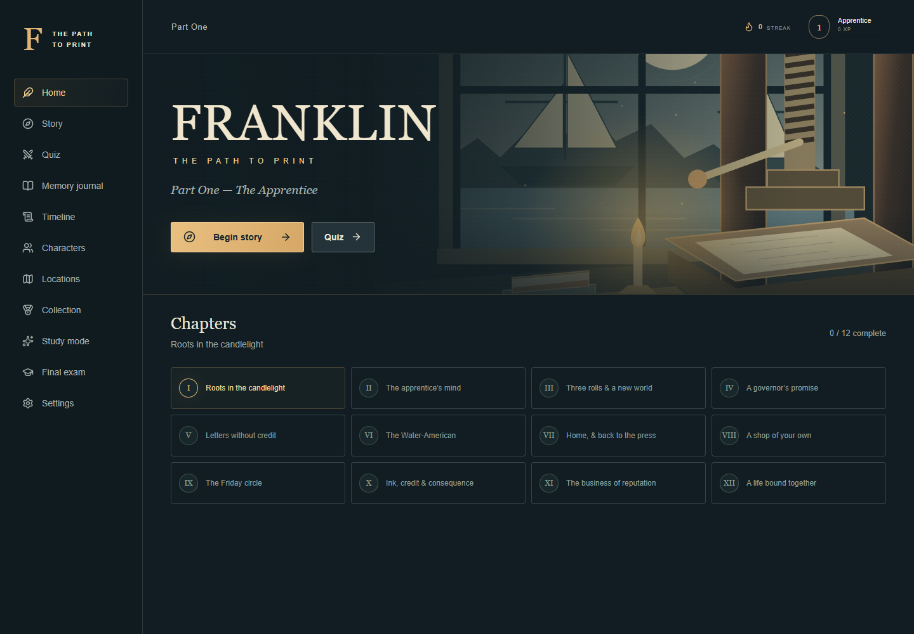

# FRANKLIN: THE PATH TO PRINT

### Part One — The Apprentice

A complete, local-first narrative learning game built for a detailed quiz on **the supplied 27-page scan of Part One** of Benjamin Franklin’s _Autobiography_. Play through the story, reconstruct conversations, type what you remember, and turn missed details into targeted rematches.



## What is inside

- **272 questions**: 252 distinct factual prompts, 12 chronology challenges, and 8 matching challenges. Most questions require typed recall; Easy mode adds recognition practice.
- **12 chronological story chapters, 60 playable scenes**, and a recall boss trial at each chapter’s end.
- **252 source-linked memory cards**, 66 character profiles and an interactive relationship web, a 60-item timeline, and a schematic location map.
- Historical decisions with a separate personal-choice mode; the source’s outcomes stay fixed. Dialogue reconstruction is explicitly labeled paraphrase.
- Quiz: Easy, Normal, Hard, Nightmare, 10/20/40-question rounds and Everything. A separate balanced **20-question Final Exam** spans all 12 chapters and mixes recall, relationships, books, places, ideas, matching and ordering.
- Franklin’s Trouble List, weighted review, confidence, due dates, mastery, XP, levels, streaks, combos and eight achievements.
- Flashcards and character, chronology, people, place, publication/book, virtue/idea and obscure-detail drills.
- Browser saves, save export/import, confirmed reset, optional synthesized sound, reduced motion, large text, keyboard ordering controls and mobile navigation.
- Full source PDF and all 27 readable scan images available inside the game. No external fonts, images, audio, accounts or runtime APIs.

## Play locally

Use Node.js 24 and npm. From this directory:

```sh
npm install
npm run dev
```

Open the local URL printed by Vite. For a production preview:

```sh
npm run build
npm run preview
```

The production site is the `dist/` directory. Serve it through HTTP; opening `index.html` directly with a `file:` URL is not supported.

### A suggested study session

1. Take the Final Exam to find weak areas immediately; story completion is not required.
2. Read every missed answer and its scan, then use **Retry missed**.
3. Use **Study mode** and the journal’s **Study all entries** to reach every fact without story locks.
4. Try Nightmare details and the chronology drill, then take another Final Exam.

Typed names and dates use explicit accepted forms, normalized punctuation and token order. Different wording opens a comparison screen. The player must honestly mark whether the answer means the same; these answers are labeled **self-assessed** in results. No AI grading or fuzzy guessing is used. A miss stays on the Trouble List until two consecutive correct recalls; three establish mastery. Review weights repeated misses, confidence and elapsed time.

## Canonical source and accuracy

The only historical source is the user-provided **`Franklin Part 1.pdf`**, supplied under that filename even though the request also referred to “Franklin Part 1(2).pdf.” It is 27 scanned PDF spreads covering printed Part One pages 1–53. Every spread was rendered and visually inspected before content authoring. Machine extraction returned no text on all 27 pages.

[The complete page-by-page source outline](docs/source-outline.md) records the extraction before conversion to scenes and questions. Every fact, question, scene, character and location has `sourcePages`. These are **PDF spread numbers 1–27**, not printed book page numbers. Source buttons open the actual scans so the reader can verify details.

No external summaries or biographical sources were used for game facts. Uncertainty and retrospective chronology are preserved. Anonymous names are not supplied from outside knowledge. The later thirteen-virtue program is not inserted into this excerpt. Virtue/idea drills use the reflections actually present in Part One. Editorial material is distinguished from Franklin’s narrative. Scene atmosphere and the original SVG artwork are illustrative; dialogue is paraphrased, not invented verbatim quotation.

## Publish to GitHub Pages

The repository is prepared locally. Automatic remote publishing was unavailable on the build machine because **GitHub CLI was not installed**. No remote repository or public URL is claimed.

### Windows: prepared publishing script

Install GitHub CLI, then open a new terminal:

```powershell
winget install --id GitHub.cli --exact
gh auth login
```

In this project directory:

```powershell
powershell -ExecutionPolicy Bypass -File .\scripts\deploy.ps1
```

The script creates the public repository **`franklin-path-to-print`** under the authenticated account, or **`franklin-part-one-game`** if the first name exists. It does not overwrite either existing repository. It pushes `main`, enables Pages with the workflow build type, and prints the actual repository and Pages URLs. The zip download also works: the script initializes and commits a repository when `.git` is absent. Git must have a configured author name and email for that first commit.

### Manual commands (any platform)

After `gh auth login`, initialize and commit only if using an extracted source zip:

```sh
git init -b main
git add .
git commit -m "Build the complete source-linked Franklin learning adventure"
gh repo create franklin-path-to-print --public --source . --remote origin --push
gh api --method POST repos/{owner}/{repo}/pages -f build_type=workflow
```

`gh api` resolves `{owner}` and `{repo}` from the current repository. If the name is taken, substitute `franklin-part-one-game` in the create command. In GitHub **Settings → Pages → Build and deployment**, the source should be **GitHub Actions**. If the first run began before Pages was enabled, run:

```sh
gh workflow run deploy.yml --ref main
gh run list --workflow deploy.yml
```

The resulting URL is `https://<authenticated-account>.github.io/<repository-name>/`. Vite uses `base: './'`; navigation uses hash routes, so assets and refreshes work under either repository name without a 404 redirect or configuration edit. The deploy workflow verifies the build and browser tests before uploading `dist` to Pages. Pull requests run validation without publishing. The workflow follows [GitHub’s custom Pages workflow documentation](https://docs.github.com/en/pages/getting-started-with-github-pages/using-custom-workflows-with-github-pages).

## Verification

```sh
npm run check
npm run test:e2e
```

`check` runs formatting, TypeScript, 16 unit/data integrity tests and the production build. Seven browser tests use installed Microsoft Edge on Windows; on macOS/Linux first run `npx playwright install chromium`. CI installs Chromium and its system dependencies automatically.

Browser tests cover every screen, 390px mobile overflow, source image viewing, scoring, retries, persistence, confirmed reset, all 60 scenes and 12 chapter trials, and both production repository subpaths. [Validation details](docs/quality-checks.md).

## Project structure

```text
src/
  data/           Facts, questions, chapters, events, people, places, cards
  components/     Save provider, accessible dialogs, source viewer, recall forms
  pages/          Story, quiz/bosses, journal, timeline, map, study, settings
  lib/            Grading, adaptive review, saves, achievements and tests
  App.tsx         Hash navigation, home and optional WebMCP integration
  styles.css      Main visual design
  game.css        Game screens and responsive layouts
public/
  source/         Canonical PDF and all 27 scan images
  press-room.svg  Original decorative artwork
docs/             Source outline, validation record and screenshots
scripts/          GitHub publishing helper
tests/            Browser journeys and production subpath server
.github/workflows/deploy.yml
```

Built with React, Vite, TypeScript and CSS. The small runtime icon dependency is Lucide. Progress uses the `franklin-path-to-print-v1` localStorage key; it is tied to this browser and origin. Completed answers save immediately. Leaving or refreshing an unfinished quiz starts a new round while retaining those answer records. Export from Settings to move a save between browsers or from the local preview to Pages.

## Content and asset ownership

The interface, code, derived study material and original SVG artwork were created for this project. The supplied PDF and rendered scans retain their original attribution; this project does not grant a new license over them. Third-party packages retain their respective licenses.
